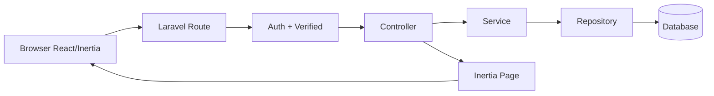
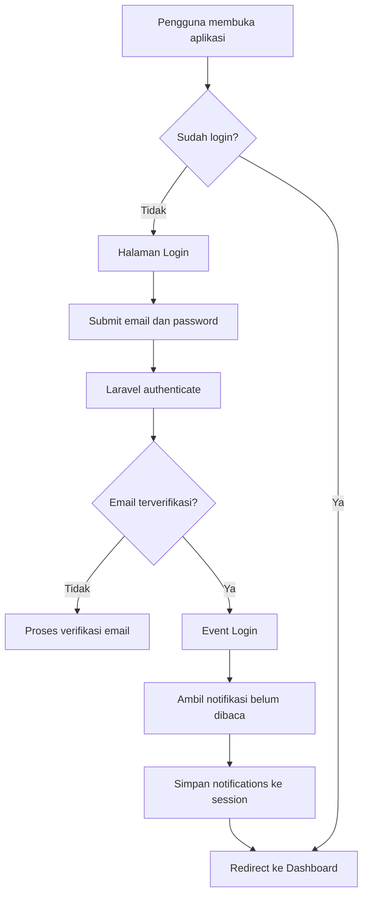
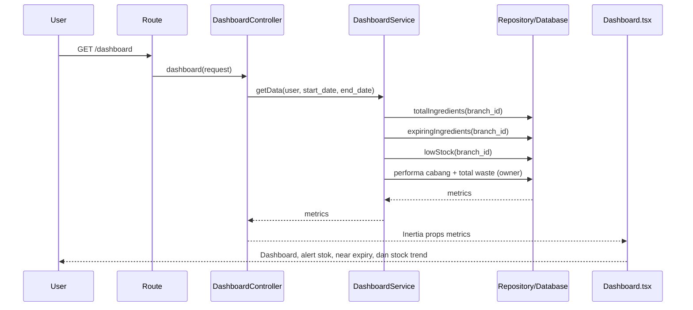
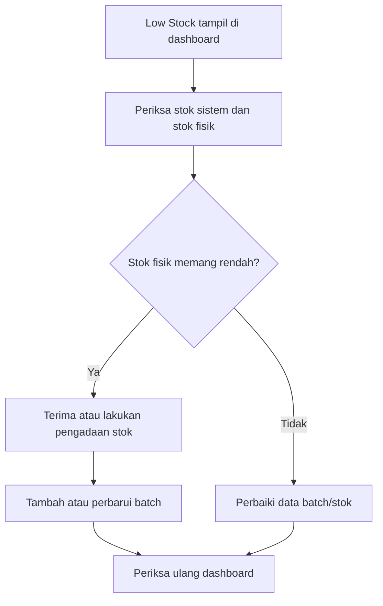
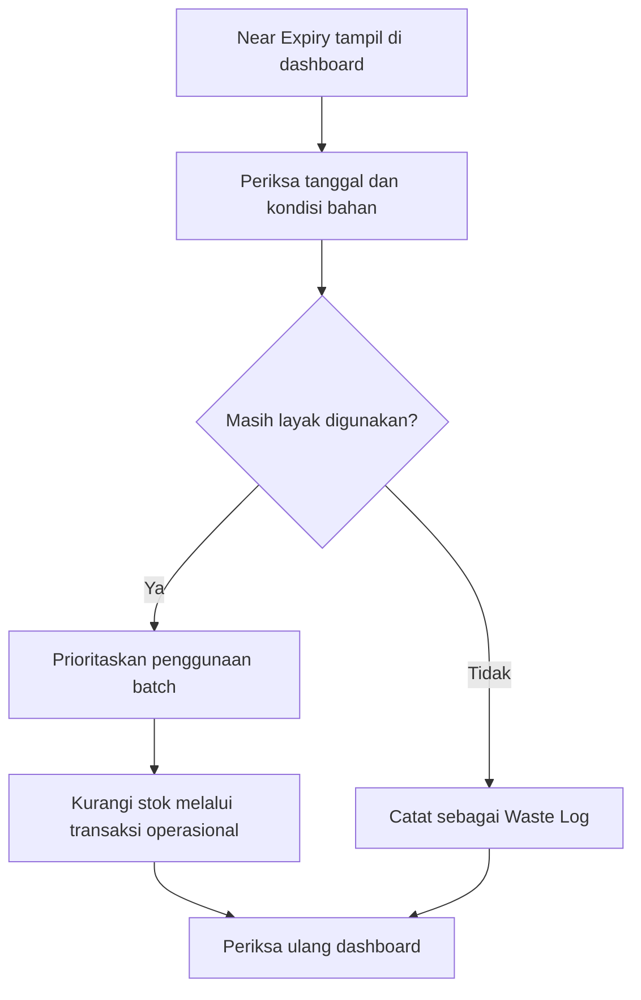
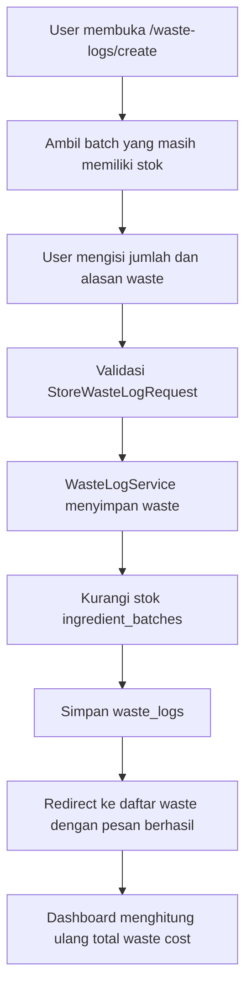
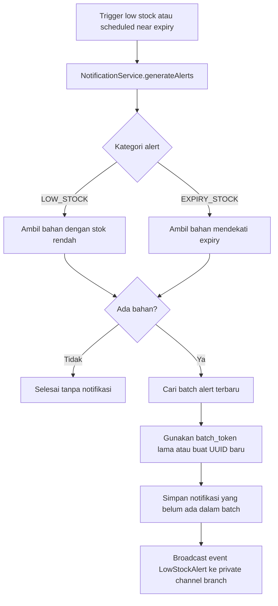
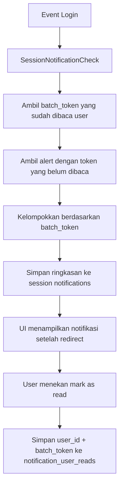
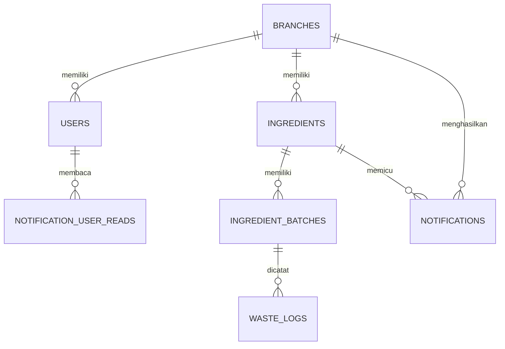
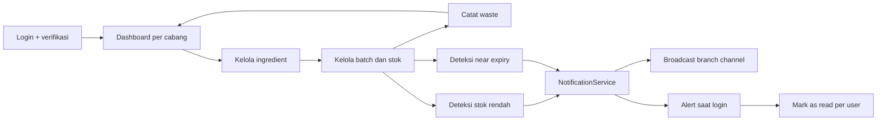

# Alur Sistem Smart Waste

Dokumen ini menjelaskan alur sistem berdasarkan implementasi Laravel + Inertia/React yang ada di repository.

## 1. Gambaran Umum

Smart Waste adalah aplikasi pengelolaan persediaan bahan makanan per cabang yang mencakup:

- autentikasi dan verifikasi email pengguna;
- pengelolaan cabang, pengguna, bahan, dan batch bahan;
- pemantauan stok minimum dan bahan yang mendekati kedaluwarsa;
- pencatatan waste yang mengurangi stok batch;
- dashboard metrik dan performa cabang;
- notifikasi stok rendah dan near expiry.

Arsitektur request utamanya:

## 2. Alur Akses dan Login

- Halaman `/` diarahkan ke halaman login untuk guest.
- Route aplikasi berada dalam middleware `auth` dan `verified`.
- Setelah login berhasil, session diregenerasi lalu pengguna diarahkan ke `/dashboard`.
- Listener `SessionNotificationCheck` mengambil batch notifikasi yang belum dibaca untuk user dan menyimpannya sebagai flash session.
- Logout menghapus autentikasi, meng-invalidasi session, dan mengarahkan pengguna kembali ke login.

## 3. Alur Dashboard

Data dashboard yang dihitung:

- `totalIngredients`: jumlah bahan pada cabang user;
- `expiringIngredients`: bahan/batch yang mendekati kedaluwarsa;
- `lowStockIngredients`: bahan dengan stok di bawah batas minimum;
- `branchPerformance`: hanya ditambahkan untuk user dengan role `owner`;
- `totalWasteCost`: hanya ditambahkan untuk user dengan role `owner`.

Dashboard React menampilkan metrik tersebut melalui `TopMetricRow`, daftar low stock dan near expiry melalui `AlertList`, serta menyediakan modal untuk menambah bahan.

## 3.1. Tindakan User Saat Ada Alert

### Jika ingredient berstatus Low Stock

Low stock berarti stok bahan sudah berada di bawah batas minimum. User sebaiknya:

1. Membuka detail ingredient untuk memeriksa stok aktual, batas minimum, dan batch yang masih aktif.
2. Memastikan jumlah stok di sistem sesuai dengan stok fisik.
3. Menambahkan batch baru melalui menu `Ingredient Batches` setelah stok baru diterima, atau memperbarui data batch yang benar jika ada kesalahan pencatatan.
4. Memeriksa kembali dashboard setelah penyimpanan untuk memastikan jumlah stok sudah melewati batas minimum.
5. Jika stok sebenarnya habis karena rusak, tumpah, atau tidak layak pakai, mencatatnya melalui `Waste Logs` agar pengurangan stok dan biaya waste terdokumentasi.

Alur singkatnya:

### Jika ingredient berstatus Near Expiry

Near expiry berarti terdapat batch yang mendekati tanggal kedaluwarsa. User sebaiknya:

1. Membuka detail ingredient atau batch untuk melihat tanggal kedaluwarsa dan jumlah stok.
2. Memeriksa kondisi fisik bahan dan memastikan bahan masih aman digunakan.
3. Memprioritaskan batch tersebut untuk dipakai terlebih dahulu sesuai prosedur operasional, dengan prinsip **FEFO** (First Expired, First Out).
4. Jika bahan sudah tidak layak digunakan, mencatat jumlah yang dibuang melalui `Waste Logs` dan memilih batch terkait.
5. Memperbarui atau menghapus batch hanya jika data batch memang salah; penghapusan tidak boleh digunakan untuk menyembunyikan waste.
6. Memeriksa kembali daftar near expiry setelah stok digunakan atau waste dicatat.

Alur singkatnya:

Catatan: aplikasi saat ini menyediakan pencatatan stok, batch, dan waste, tetapi belum terlihat memiliki fitur pengadaan, transfer stok antar cabang, atau tombol tindakan langsung pada kartu alert. Aktivitas pengadaan dan penggunaan bahan tetap dilakukan melalui prosedur operasional di luar aplikasi, lalu hasilnya diperbarui di sistem.

## 4. Alur Master Data

### Cabang

Endpoint utama menggunakan resource route `/branches`.

1. User membuka daftar cabang.
2. Controller meminta data melalui `BranchService`.
3. User mengisi form tambah atau edit cabang.
4. `StoreBranchRequest` atau `UpdateBranchRequest` memvalidasi input.
5. Data disimpan ke tabel `branches`.
6. Sistem mengembalikan response Inertia atau JSON, sesuai jenis request.
7. Penghapusan normal menggunakan soft delete jika model mendukungnya; restore dan force delete tersedia melalui endpoint khusus.

### Bahan/Ingredient

Endpoint utama menggunakan resource route `/ingredients`.

1. User membuka daftar bahan pada cabang yang sesuai.
2. Controller melakukan otorisasi resource melalui policy.
3. Input divalidasi oleh request terkait.
4. Saat membuat bahan, `IngredientService` memulai transaksi database.
5. Data bahan disimpan.
6. Jika form menyertakan batch awal, batch dibuat dalam transaksi yang sama.
7. Jika seluruh proses berhasil, transaksi di-commit; jika gagal, transaksi di-rollback.
8. Tersedia endpoint pengecekan kode bahan dan endpoint JSON daftar bahan.

### Batch Bahan

Endpoint utama menggunakan resource route `/ingredient-batches`.

1. User memilih bahan yang akan diberi batch.
2. Data batch divalidasi.
3. Batch disimpan atau diperbarui.
4. Batch dapat dihapus secara normal, dipulihkan, atau dihapus permanen.
5. Batch menjadi sumber stok aktif untuk dashboard dan pencatatan waste.

## 5. Alur Pencatatan Waste

- Daftar waste dapat difilter berdasarkan tanggal.
- Detail waste menampilkan cabang, bahan, dan batch terkait.
- Saat waste dihapus, repository mengembalikan stok ke batch sesuai aturan service/repository.
- Policy resource digunakan untuk membatasi akses data waste.

## 5.1. Alur Pemakaian Ingredient Normal

Ingredient yang dipakai untuk produksi atau operasional tidak dicatat sebagai waste. User menggunakan menu **Record usage** di dashboard atau membuka `/stock-consumptions/create`.

1. User memilih batch aktif yang masih memiliki stok.
2. Cabang otomatis mengikuti cabang ingredient pada batch.
3. User mengisi tanggal pemakaian, jumlah, tujuan pemakaian, dan catatan bila diperlukan.
4. Sistem memvalidasi bahwa batch milik cabang user dan jumlah tidak melebihi stok tersedia.
5. Sistem menyimpan transaksi pemakaian pada `stock_consumptions`.
6. Sistem mengurangi `quantity_remaining` pada batch dalam transaksi database yang sama.
7. Data penggunaan tidak masuk ke perhitungan biaya waste.

Perbedaan pencatatan:

| Kondisi | Pencatatan | Dampak |
| --- | --- | --- |
| Ingredient dipakai untuk produksi | Stock Consumption | Mengurangi stok, bukan waste |
| Ingredient rusak, kedaluwarsa, tumpah, atau tidak layak | Waste Log | Mengurangi stok dan menambah biaya kerugian |

### Template Stock Consumption

Untuk pemakaian yang berulang, user dapat membuat template satu kali melalui `Create template`. Template menyimpan:

- nama template;
- ingredient;
- jumlah pemakaian default;
- tujuan pemakaian;
- catatan opsional.

Saat template dipilih pada form **Record stock usage**, sistem mengisi data tersebut secara otomatis dan memilih batch aktif ingredient dengan tanggal kedaluwarsa terdekat. User tetap dapat memeriksa atau mengganti batch dan jumlah sebelum menyimpan.

Template tidak menyimpan `batch_id` secara permanen karena batch dapat habis atau berganti pada penerimaan stok berikutnya. Template receipt hanya memiliki daftar item ingredient dan jumlah default. Saat dipilih, frontend mengisi beberapa baris pemakaian sekaligus; histori `stock_consumptions` tetap berdiri sendiri tanpa relasi ke template.

## 6. Alur Notifikasi

### Pembuatan alert

Setiap record notifikasi memiliki `branch_id`, `ingredient_id`, `category`, `batch_token`, dan `message`. `batch_token` digunakan untuk mengelompokkan beberapa ingredient dalam satu rangkaian alert.

### Near expiry terjadwal

- Job `NotifyNearExpiry` mengambil seluruh cabang.
- Untuk setiap cabang, job memanggil `generateAlerts(branch_id, 'EXPIRY_STOCK')`.
- Scheduler saat ini menjalankan command `app:near-expiry-notification` setiap hari pukul **06:00**.

### Notifikasi setelah login

Endpoint notifikasi:

- `GET /notifications`: halaman daftar notifikasi dengan pagination;
- `GET /notifications/list`: daftar notifikasi dalam JSON;
- `POST /notifications/mark-as-read`: menandai satu `batch_token` sebagai sudah dibaca untuk user tertentu.

## 7. Hak Akses dan Scope Data

- Semua route bisnis memerlukan user yang sudah login dan email terverifikasi.
- Resource `Ingredient`, `IngredientBatch`, `WasteLog`, dan sebagian operasi user memakai policy/resource authorization.
- User memiliki `branch_id`, sehingga data operasional umumnya dibatasi ke cabang user.
- Role `owner` mendapat data lintas cabang untuk performa cabang dan total biaya waste.
- Event broadcast memakai private channel `branch.{branch_id}`.

## 8. Komponen Data Utama

Relasi bisnis utama:

- satu cabang memiliki banyak user, ingredient, batch, waste log, dan notification;
- satu ingredient dapat memiliki banyak batch;
- waste log terkait dengan batch ingredient;
- status sudah dibaca disimpan per user dan per `batch_token`.

## 9. Catatan Implementasi yang Perlu Diperiksa

Bagian ini mencatat perbedaan atau risiko yang terlihat dari kode saat dokumentasi dibuat.

1. Kebutuhan di README menyebut alert near expiry pukul 08:00, sedangkan scheduler saat ini berjalan pukul 06:00 di `routes/console.php`.
2. Kebutuhan penggabungan pesan menyebut format seperti `Ingredient A dan 3 lainnya`, tetapi implementasi `setMessageNotif()` masih menghasilkan teks `and other ingredients` dan penghitungannya perlu ditinjau.
3. Pencarian alert terbaru di `NotificationRepository::getRecentAlert()` menerima `branchId`, tetapi query yang terlihat belum memakai filter `branch_id`; ini berisiko mencampur batch alert antar cabang.
4. Pencarian batch alert terbaru di `NotificationService::generateAlerts()` menggunakan kategori `LOW_STOCK` meskipun alert dapat berasal dari kategori `EXPIRY_STOCK`; ini perlu diperiksa agar grouping kategori tetap benar.
5. Kebutuhan menyebut `action_url` ke halaman index sesuai kategori, tetapi field dan pengisian `action_url` belum terlihat pada model/service notifikasi.
6. `NotificationController::index()` dan `notifications()` meneruskan object user ke repository, sementara repository saat ini memperlakukan parameter tersebut seperti `branchId`; scope data notifikasi perlu diverifikasi.
7. Event yang bernama `LowStockAlert` juga digunakan untuk broadcast alert expiry. Nama event atau event terpisah dapat dipertimbangkan agar lebih jelas.

## 10. Ringkasan Alur End-to-End

Dashboard bersifat real-time

Setelah stok ditambah dan total stok sudah mencapai minimum_stock, ingredient langsung hilang dari daftar Low Stock.
Jika masih di bawah minimum, tetap ditampilkan.

// Ingredient sebaiknya masuk ke Waste Logs ketika benar-benar tidak dapat digunakan atau harus dibuang, bukan hanya karena statusnya Low Stock atau Near Expiry.

Contohnya:

sudah melewati tanggal kedaluwarsa;
rusak, busuk, berjamur, atau berubah kualitas;
tumpah atau jatuh sehingga tidak dapat digunakan;
jumlah fisik berkurang karena kerusakan;
hasil pengecekan kualitas menyatakan bahan tidak layak pakai;
sisa bahan produksi tidak dapat disimpan atau digunakan kembali.
Alurnya:

Periksa kondisi fisik ingredient.
Pastikan bahan tidak aman atau tidak layak digunakan.
Buka menu Waste Logs.
Pilih batch ingredient yang terdampak.
Masukkan jumlah yang dibuang dan alasan waste.
Simpan pencatatan.
Near Expiry berarti bahan masih mungkin digunakan dan sebaiknya diprioritaskan dengan prinsip FEFO. Namun, jika setelah pemeriksaan bahan sudah tidak layak digunakan, barulah dicatat sebagai waste. Low Stock sendiri bukan alasan untuk membuat waste log.